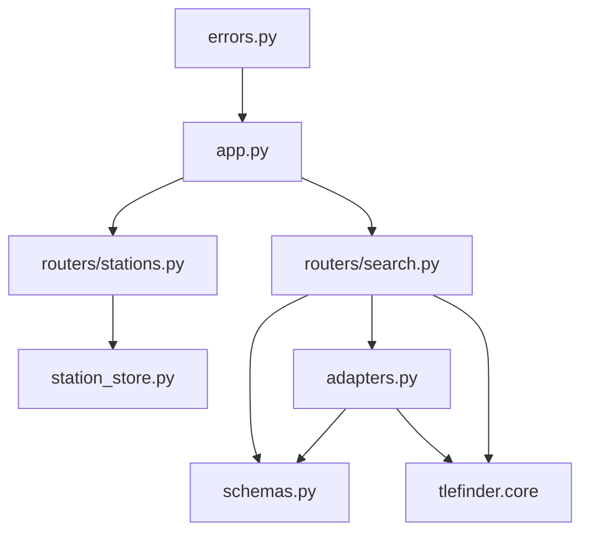

# TLE Finder API Architecture

## 1. Purpose and Scope

This document defines the implemented architecture for the HTTP API layer of TLE Finder.

The API is responsible for:

- exposing search execution through OpenAPI-friendly HTTP endpoints
- translating JSON request bodies into the shared `tlefinder.core.SearchRequest` model
- translating `tlefinder.core.SearchResponse` into JSON responses
- owning optical ground station list persistence in a backend-controlled YAML file
- returning machine-readable validation, persistence, TLE, and execution errors

The API is not responsible for:

- pass detection
- filtering, scoring, ranking, or orbit propagation
- TLE download, cache, parsing, or freshness policy
- GUI layout, form behavior, or HTML rendering

Those search responsibilities remain in `tlefinder.core`, as defined by `ARCHITECTURE.md`.
The API is a thin adapter around the shared core search workflow.

## 2. Architecture Principles

- **Small route surface**: expose only routes needed by the GUI and programmatic clients.
- **OpenAPI first**: request, response, and error bodies are Pydantic models so FastAPI can generate accurate `/openapi.json` and Swagger documentation.
- **Core boundary is strict**: route handlers never implement satellite-search behavior and always call `tlefinder.core.search_candidates()`.
- **API owns station persistence**: the YAML optical ground station file is read and written only by the API layer.
- **Stateless search execution**: each search request contains all data needed to execute that search.
- **Machine-readable errors**: validation and operational failures use a stable error response shape.
- **Deterministic adaptation**: identical API request body, configuration, and TLE dataset produce identical API response bodies.
- **Simple default behavior**: simple search accepts only station and window input; all other criteria are system defaults.

## 3. Framework

Use **FastAPI** as the API framework.

Rationale:

- FastAPI provides OpenAPI generation from Python type hints and Pydantic schemas.
- Pydantic validation keeps the API contract explicit and testable.
- The API can remain a thin adapter without hand-written OpenAPI documents.
- The same app can serve the GUI backend and direct programmatic clients.

Recommended runtime dependencies:

```toml
dependencies = [
    "fastapi>=0.115,<1.0",
    "uvicorn[standard]>=0.30,<1.0",
    "pyyaml>=6.0,<7.0",
]
```

Recommended test dependency:

```toml
[tool.poetry.group.dev.dependencies]
httpx = ">=0.27,<1.0"
```

`httpx` is already a core runtime dependency and can also be used by FastAPI's test client ecosystem.

## 4. Current Package Layout

```text
api/src/tlefinder/api/
  __init__.py
  app.py
  adapters.py
  config.py
  errors.py
  schemas.py
  station_store.py
  routers/
    __init__.py
    search.py
    stations.py

api/tests/unit/
  test_adapters.py
  test_errors.py
  test_station_store.py

api/tests/functional/
  test_openapi.py
  test_search_routes.py
  test_station_routes.py
```

### 4.1 `app.py`

Purpose: create and configure the FastAPI application.

Responsibilities:

- define `create_app(settings: ApiSettings | None = None) -> FastAPI`
- register `/api/v1` routers
- register exception handlers from `errors.py`
- attach API settings to application state
- expose a module-level `app = create_app()` for Uvicorn

The app factory keeps tests simple because each test can create an app with a temporary station YAML path and mocked core search function.

### 4.2 `config.py`

Purpose: centralize API runtime configuration.

Recommended model:

```python
@dataclass(slots=True)
class ApiSettings:
    station_store_path: Path
```

Configuration source:

- read `TLEFINDER_STATION_STORE_PATH` when set
- otherwise default to a backend-controlled local path such as `tlefinder/data/stations.yaml`

The default path must be documented and must not be inside the core package.

### 4.3 `schemas.py`

Purpose: define all public JSON contracts.

Responsibilities:

- Pydantic request models
- Pydantic response models
- error response models
- schema-level validation for HTTP-specific input rules
- `extra="forbid"` on request models where unsupported fields must be rejected

Schemas are API contracts. They should not expose Python dataclass internals that are not part of the HTTP contract.

### 4.4 `adapters.py`

Purpose: translate between API schemas and core dataclasses.

Responsibilities:

- convert station schemas to `tlefinder.core.GroundStation`
- convert search-window schemas to `tlefinder.core.SearchWindow`
- convert API criteria schemas to `tlefinder.core.SearchCriteria`
- apply simple-search defaults
- convert `tlefinder.core.SearchResponse` to API response schemas
- serialize pass times as UTC ISO 8601 strings

This module is the only place that knows both the API schemas and the core model shape.

### 4.5 `station_store.py`

Purpose: own YAML-backed optical ground station persistence.

Responsibilities:

- create the YAML file on first access
- load all station entries
- validate a full station list before saving
- reject invalid station entries
- reject duplicate station names with different coordinates
- reject duplicate physical stations in submitted replacement lists
- preserve the existing file if validation or writing fails
- atomically replace the YAML file after validation succeeds
- add a named search station after the core accepts and executes the search request

The core package must never import this module.

### 4.6 `routers/stations.py`

Purpose: expose station list persistence routes.

Routes:

- `GET /api/v1/stations`
- `PUT /api/v1/stations`

Route handlers should be small. They call `station_store.py`, then return schema objects.

### 4.7 `routers/search.py`

Purpose: expose search execution routes.

Routes:

- `POST /api/v1/search/simple`
- `POST /api/v1/search/advanced`

Route handlers should:

1. accept a validated Pydantic request body
2. convert the request into a core `SearchRequest`
3. call `tlefinder.core.search_candidates()`, which owns core domain validation
4. persist the named station if the successful core request includes a new named station
5. return a JSON search response

Search routes must not implement pass detection, filtering, scoring, ranking, orbit propagation, or TLE freshness rules.

### 4.8 `errors.py`

Purpose: convert expected API and core failures into machine-readable HTTP errors.

Responsibilities:

- define API-specific exception classes for station persistence failures
- register FastAPI exception handlers
- map Pydantic validation errors, core validation errors, TLE failures, and unexpected errors to the documented error response shape

## 5. Dependency Direction

The API depends on the core. The core does not depend on the API.



Dependency rules:

- `tlefinder.core` must not import `fastapi`, `pydantic`, `yaml`, or `tlefinder.api`.
- `station_store.py` must not call search functions.
- `routers/search.py` may call `station_store.py` only for named-station persistence.
- `adapters.py` may import core dataclasses and enums, but must not call the search engine.

## 6. Public HTTP API

All routes are versioned under `/api/v1`.

### 6.1 `GET /api/v1/stations`

Purpose: return the persisted optical ground station list.

Behavior:

- creates the YAML station file on first access if it does not exist
- returns the full persisted list
- returns a machine-readable error if the file cannot be created or loaded

Response body:

```json
{
  "stations": [
    {
      "name": "Paris Observatory",
      "latitude": 48.8367,
      "longitude": 2.3365,
      "elevation_m": 67.0
    }
  ]
}
```

### 6.2 `PUT /api/v1/stations`

Purpose: replace the complete persisted optical ground station list.

Behavior:

- validates every submitted station before writing
- rejects invalid latitude, longitude, elevation, or station name values
- rejects duplicate physical stations in the submitted list
- rejects duplicate station names that use different coordinates
- writes with atomic replacement so partial writes do not corrupt the previous list
- preserves the previous persisted list when validation or writing fails

Request body:

```json
{
  "stations": [
    {
      "name": "Paris Observatory",
      "latitude": 48.8367,
      "longitude": 2.3365,
      "elevation_m": 67.0
    }
  ]
}
```

Success response body uses the same shape as `GET /api/v1/stations`.

### 6.3 `POST /api/v1/search/simple`

Purpose: execute a simple satellite search.

The simple search route accepts only:

- optical ground station
- search-window start time
- search-window duration

The route applies all other criteria as API defaults before calling the core.

Request body:

```json
{
  "station": {
    "name": "Paris Observatory",
    "latitude": 48.8367,
    "longitude": 2.3365,
    "elevation_m": 67.0
  },
  "window": {
    "start_at": "2026-05-12T20:00:00Z",
    "duration_minutes": 10
  }
}
```

Simple-search defaults:

| Core field | Value |
| --- | --- |
| `satellite_group` | `active` |
| `criteria.culmination_altitude_deg` | `{ "minimum": 0, "maximum": 90 }` |
| `criteria.start_azimuth_deg` | `null` |
| `criteria.end_azimuth_deg` | `null` |
| `criteria.culmination_azimuth_deg` | `null` |
| `criteria.sun_proximity_deg` | `{ "minimum": 0, "maximum": 180 }` |
| `criteria.satellite_altitude_km` | `{ "minimum": 200, "maximum": 2000 }` |
| `criteria.result_limit` | `10` |
| `criteria.score_threshold` | `0`, representing disabled threshold filtering on the core `0..100` score scale |

The API must not expose scoring configuration, scoring weights, or ranking internals in this request.
The core model does not currently have a nullable threshold field, so the API represents disabled threshold filtering as `score_threshold = 0`.
Because core match scores are constrained to `[0, 100]`, this value does not remove any scored candidate that passes the hard filters.

### 6.4 `POST /api/v1/search/advanced`

Purpose: execute a search with supported optional criteria.

Request body:

```json
{
  "station": {
    "name": "Paris Observatory",
    "latitude": 48.8367,
    "longitude": 2.3365,
    "elevation_m": 67.0
  },
  "window": {
    "start_at": "2026-05-12T20:00:00+00:00",
    "duration_minutes": 10
  },
  "satellite_group": "active",
  "criteria": {
    "culmination_altitude_deg": {
      "minimum": 20,
      "maximum": 80
    },
    "start_azimuth_deg": {
      "target": 270,
      "tolerance": 20
    },
    "sun_proximity_deg": {
      "minimum": 30,
      "maximum": 180
    },
    "satellite_altitude_km": {
      "minimum": 400,
      "maximum": 1200
    },
    "result_limit": 5,
    "score_threshold": 60
  }
}
```

Supported `satellite_group` values:

- `active`
- `visual`
- `amateur`

If `satellite_group` is omitted, the API uses `active`.

Supported criteria fields:

- `culmination_altitude_deg`
- `culmination_altitude_target_deg`
- `start_azimuth_deg`
- `end_azimuth_deg`
- `culmination_azimuth_deg`
- `sun_proximity_deg`
- `satellite_altitude_km`
- `result_limit`
- `score_threshold`

Request models must use `extra="forbid"` so unsupported active search criteria are rejected with `422`.

## 7. Public Data Contracts

### 7.1 Station Schema

```json
{
  "name": "Paris Observatory",
  "latitude": 48.8367,
  "longitude": 2.3365,
  "elevation_m": 67.0
}
```

Validation:

- `name` is required when the station is intended to be persisted
- `name` must be a non-empty string after trimming whitespace
- `latitude` must be numeric and within `[-90, 90]`
- `longitude` must be numeric and within `[-180, 180]`
- `elevation_m` must be numeric and within `[-500, 8000]`

Search requests may use unnamed stations if the station should not be persisted.
Persisted station list entries must always have a name.

### 7.2 Search Window Schema

```json
{
  "start_at": "2026-05-12T22:00:00+02:00",
  "duration_minutes": 10
}
```

Validation:

- `start_at` must be an ISO 8601 datetime string with an explicit UTC offset
- accepted UTC forms include `Z` and `+00:00`
- local time inputs must include an explicit offset such as `+01:00` or `-05:00`
- the API must not infer an offset from the optical ground station location
- `duration_minutes` must be greater than `0` and no greater than `30`

### 7.3 Constraint Schemas

Range constraint:

```json
{
  "minimum": 20,
  "maximum": 80
}
```

Target tolerance constraint:

```json
{
  "target": 270,
  "tolerance": 20
}
```

Validation:

- apparent-altitude bounds use `[0, 90]` degrees
- azimuth targets use `[0, 360)` degrees
- Sun-proximity bounds use `[0, 180]` degrees
- satellite-altitude bounds use `[200, 15000]` kilometers
- candidate-selection threshold uses `[0, 100]`
- result limit is a strictly positive integer
- any range with `minimum > maximum` is invalid

### 7.4 Search Response Schema

Search responses use the shared core response meaning.

```json
{
  "status": "results",
  "results": [
    {
      "rank": 1,
      "match_score": 87.5,
      "satellite": {
        "name": "ISS (ZARYA)",
        "catalog_number": 25544,
        "tle": {
          "name": "ISS (ZARYA)",
          "line1": "1 25544U 98067A ...",
          "line2": "2 25544 ...",
          "epoch_utc": "2026-05-12T14:12:00Z",
          "source_group": "active"
        }
      },
      "geometry": {
        "start_time_utc": "2026-05-12T20:02:10Z",
        "end_time_utc": "2026-05-12T20:08:42Z",
        "culmination_time_utc": "2026-05-12T20:05:20Z",
        "start_azimuth_deg": 252.1,
        "end_azimuth_deg": 63.4,
        "culmination_azimuth_deg": 319.8,
        "culmination_altitude_deg": 71.2
      },
      "metrics": {
        "satellite_altitude_km": 420.5,
        "sun_proximity_deg": 118.0
      },
      "diagnostics": {}
    }
  ],
  "diagnostics": {
    "satellite_count": 1200,
    "candidate_count": 8,
    "returned_count": 1
  }
}
```

No-result response:

```json
{
  "status": "no_result",
  "results": [],
  "diagnostics": {
    "satellite_count": 1200,
    "candidate_count": 0,
    "returned_count": 0
  }
}
```

No-result searches return HTTP `200`; they are not errors.

All response times must include an explicit UTC reference. The recommended JSON form is an ISO 8601 string ending in `Z`.

## 8. Station Persistence Design

### 8.1 YAML File Shape

The station store is a backend-controlled YAML file.

Recommended YAML shape:

```yaml
stations:
  - name: Paris Observatory
    latitude: 48.8367
    longitude: 2.3365
    elevation_m: 67.0
```

The API should preserve the semantic content of the file, not comments or formatting.

### 8.2 First Access Creation

`GET /api/v1/stations` and any route that needs station persistence must call the station store through an `ensure_store_exists()` path.

If the YAML file does not exist:

1. create parent directories as needed
2. create a YAML file containing an empty station list
3. return an empty station list

If creation fails, return a persistence error response.

### 8.3 Duplicate Detection

A physical station key is computed from:

- latitude
- longitude
- elevation in meters

Each value is truncated toward zero to five decimal places before comparison.
Matching normalized values represent the same physical station.

Example:

```text
48.836789 -> 48.83678
-1.234569 -> -1.23456
67.123456 -> 67.12345
```

Duplicate rules:

- submitted replacement lists must not contain two entries for the same physical station
- submitted replacement lists must not contain the same name with different physical coordinates
- the persisted list must contain no more than one name for the same physical station
- if a successful search request submits a named station whose normalized coordinates match an existing station with another name, preserve the existing station and do not add a duplicate
- if a successful search request submits a named station whose name and normalized coordinates are new, append it to the station file

### 8.4 Atomic Write Strategy

`PUT /api/v1/stations` must validate the full list before writing.

After validation:

1. write the new YAML content to a temporary file in the same directory
2. flush and close the temporary file
3. atomically replace the target file with the temporary file
4. remove the temporary file on failure when possible

The previously persisted list must remain readable if validation or writing fails.

## 9. Search Workflow

### 9.1 Simple Search

```text
HTTP JSON body
  -> SimpleSearchRequest schema validation
  -> adapters.simple_search_to_core_request()
  -> core SearchRequest with active group and default criteria
  -> tlefinder.core.search_candidates()
  -> station_store.add_station_if_new() for named stations from successful searches
  -> adapters.core_response_to_api_response()
  -> HTTP 200 SearchResponse
```

The simple route must not allow clients to pass advanced criteria, score threshold, result limit, scoring configuration, scoring weights, or ranking rules.

### 9.2 Advanced Search

```text
HTTP JSON body
  -> AdvancedSearchRequest schema validation
  -> adapters.advanced_search_to_core_request()
  -> core SearchRequest
  -> tlefinder.core.search_candidates()
  -> station_store.add_station_if_new() for named stations from successful searches
  -> adapters.core_response_to_api_response()
  -> HTTP 200 SearchResponse
```

The advanced route accepts only supported criteria listed in this document.
Unsupported fields are rejected before search execution.

### 9.3 Named Station Persistence During Search

Search requests do not need to reference an already persisted station.

When a search request includes a station name:

1. validate and convert the request
2. execute the search request through `tlefinder.core.search_candidates()`
3. add the station to the persisted station list if it is a new physical station
4. preserve an existing station name if coordinates match an already persisted station

`search_candidates()` is the only domain-validation call in the normal API workflow.
The API must not call `tlefinder.core.validation.validate_search_request()` separately unless a future implementation explicitly accepts duplicated validation as a station-persistence side-effect gate.

If station persistence fails after successful search execution, the API returns an explicit machine-readable persistence error instead of silently hiding the failure.

## 10. Error Handling

All API errors use this response shape:

```json
{
  "error": {
    "code": "validation_error",
    "message": "Request validation failed.",
    "details": {},
    "field_errors": [
      {
        "field": "window.duration_minutes",
        "message": "duration_minutes must be greater than 0 and no greater than 30"
      }
    ]
  }
}
```

### 10.1 Error Codes

Recommended stable error codes:

| Code | HTTP status | Meaning |
| --- | ---: | --- |
| `validation_error` | 422 | Request body or core request validation failed |
| `station_validation_error` | 422 | Station list validation failed |
| `station_store_error` | 500 | Station YAML file could not be loaded, created, or saved |
| `tle_unavailable` | 503 | Required TLE data could not be loaded |
| `tle_stale` | 503 | TLE data is stale and search execution is blocked |
| `search_execution_error` | 500 | Expected non-validation search execution failure |
| `internal_error` | 500 | Unexpected failure |

### 10.2 Exception Mapping

| Source exception | HTTP status | Error code |
| --- | ---: | --- |
| FastAPI/Pydantic request validation error | 422 | `validation_error` |
| `tlefinder.core.ValidationError` | 422 | `validation_error` |
| API station list validation error | 422 | `station_validation_error` |
| API station store load/create/save error | 500 | `station_store_error` |
| `tlefinder.core.TleLoadError` | 503 | `tle_unavailable` |
| `tlefinder.core.TleFreshnessError` | 503 | `tle_stale` |
| `tlefinder.core.SearchExecutionError` | 500 | `search_execution_error` |
| unexpected `Exception` | 500 | `internal_error` |

Validation errors must identify the affected field when possible.
Search execution must not start if request validation fails.

## 11. OpenAPI Design

FastAPI should generate the OpenAPI document directly from the route and schema definitions.

Requirements:

- all four public routes must appear in `/openapi.json`
- request and response models must have stable names
- error responses must be declared in each route's `responses` metadata
- examples should be included for simple search, advanced search, station list, no-result search, and error responses
- unsupported fields should be rejected by schema validation, not ignored

Recommended route tags:

- `stations`
- `search`

Recommended OpenAPI metadata:

```python
FastAPI(
    title="TLE Finder API",
    version="1.0.0",
    description="HTTP API for TLE Finder search execution and optical ground station persistence.",
)
```

## 12. Test Architecture

### 12.1 Unit Tests

`test_adapters.py`:

- simple search conversion uses `SatelliteGroup.ACTIVE`
- simple search conversion applies default criteria
- advanced search conversion maps each supported criterion
- core response conversion preserves ranking, TLE data, pass geometry, metrics, diagnostics, and no-result status

`test_station_store.py`:

- first access creates an empty YAML file
- valid replacement writes the submitted station list
- invalid replacement preserves the previous file
- duplicate physical stations are rejected
- duplicate names with different coordinates are rejected
- equivalent coordinates from a named search station do not create a duplicate

`test_errors.py`:

- core validation errors map to `422`
- TLE load and freshness errors map to `503`
- station store errors map to `500`
- all errors use the documented `error` envelope

### 12.2 Functional Tests

`test_openapi.py`:

- `/openapi.json` contains `GET /api/v1/stations`
- `/openapi.json` contains `PUT /api/v1/stations`
- `/openapi.json` contains `POST /api/v1/search/simple`
- `/openapi.json` contains `POST /api/v1/search/advanced`
- public schemas and error responses are present

`test_station_routes.py`:

- `GET /api/v1/stations` creates and returns an empty station list when no file exists
- `PUT /api/v1/stations` persists a valid list
- invalid station list updates return `422` and preserve the previous persisted list
- station load/create/save failures return machine-readable `500` responses

`test_search_routes.py`:

- simple search returns HTTP `200` with ranked results from a mocked core response
- simple search no-result returns HTTP `200`, `status: "no_result"`, and `results: []`
- advanced search maps supported filters to the core request
- unsupported advanced criteria return `422`
- named station from a successful search is added to persistence
- equivalent named search station preserves the existing persisted name
- core TLE failures return `503`

## 13. Implementation Notes and Assumptions

- The first API version has no authentication or authorization.
- The route prefix is `/api/v1`.
- Station maintenance uses bulk list replacement only; no item-level station routes are included.
- The simple search route and advanced search route are separate for clearer client intent.
- The default TLE source group is `active`.
- The API should use Pydantic v2 style models when the implementation dependency set supports it.
- Pydantic request models should use strict validation where practical and reject booleans for numeric fields.
- The API must not import GUI modules.
- The core must not import API modules.
- The core remains the only implementation of search execution behavior.
