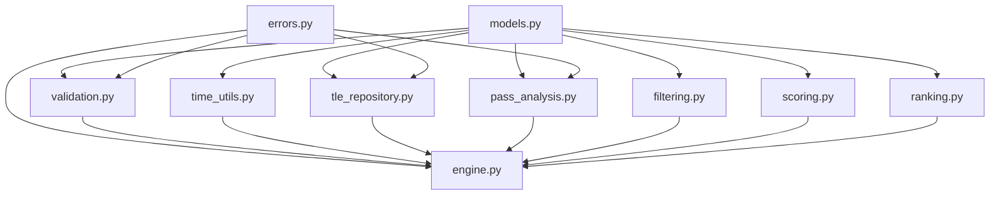

# TLE Finder Core Architecture

## 1. Purpose and Scope

This document proposes the target architecture for the **core search engine** of TLE Finder.

It covers the reusable Python logic that:

- validates a search request
- normalizes time inputs
- loads fresh TLE data
- propagates candidate orbits
- computes pass metrics
- filters and scores candidate passes
- ranks results and returns a shared response model

This document defines only the Python core search engine. The GUI and API are separate application layers that adapt their own inputs into the core request model.

This document does **not** define the architecture of:

- the Flask GUI
- any future HTTP API
- HTML rendering, forms, or templates
- output formatting helpers such as text reports or pass files

The goal is to define a functional, testable core that handles searches in Python and can be called by the API and standalone Python scripts.
The GUI must reach search execution through the API instead of importing the core directly.
The core exposes one search workflow. It does not distinguish simple search from full search; a simple search is a GUI or API preset that creates a complete `SearchRequest` with fixed/default criteria before calling the core.
The existing script in the repository is used only as reference material for terminology, behavior, and current implementation ideas.

## 2. Historical Reference Only

The repository contains a reference implementation in [find_next_pass.py](/C:/Users/jda/Work/TLEfinder/find_new_pass_web/src/get_your_tle/find_next_pass.py) that combines several concerns in one file:

- TLE download and cache decisions
- TLE parsing and catalog selection
- Skyfield propagation and event search
- geometry extraction
- sunlight estimation
- filtering logic
- result selection
- text formatting
- file output

These observations help explain the proposed module boundaries below, but they do not imply a migration-first architecture. The architecture in this document stands on its own as the target design for the core search engine.

## 3. Architecture Principles

- **Functional split**: modules are organized by responsibility, not by abstract architectural vocabulary.
- **Single orchestration entrypoint**: the full workflow is coordinated by one engine module.
- **Shared models**: all interfaces use the same Python dataclasses and enums.
- **Canonical time encoding**: the core request model uses one timezone-aware datetime representation for the search start time.
- **Deterministic behavior**: identical request + identical TLE dataset must produce identical ranked results.
- **Explicit time handling**: local time is accepted only with an explicit fixed UTC offset and is normalized to UTC before propagation.
- **Fresh-data enforcement**: searches must stop if TLE data is older than the allowed freshness limit.
- **Separable core**: the core must be importable without Flask, forms, or templates.
- **Core-owned default scoring**: default ranking behavior is defined in the core scoring module, not by GUI/API workflow labels.

## 4. Proposed Package Layout

```text
src/tlefinder/core/
  models.py
  errors.py
  validation.py
  time_utils.py
  tle_repository.py
  pass_analysis.py
  filtering.py
  scoring.py
  ranking.py
  engine.py

tests/
  unit/
  functional/
  fixtures/
  benchmarks/
```

Package naming note:

- this document uses `src/tlefinder/core` as the target package name
- if the project keeps `get_your_tle`, the same split can be applied under `src/get_your_tle/core`

## 5. Module Responsibilities

### 5.1 `models.py`

Purpose: define the shared dataclasses and enums used by the whole core.

#### Enums

- `SatelliteGroup`
  - TLE source grouping such as `ACTIVE`, `VISUAL`, `AMATEUR`.
  - used to choose which candidate dataset is loaded before propagation.
- `SearchStatus`
  - response status such as `RESULTS` or `NO_RESULT`.
  - `NO_RESULT` is a normal response state for a valid search, not an error.

#### Dataclasses

- `GroundStation`
  - fields: `latitude`, `longitude`, `elevation_m`
  - represents the observing site.
- `SearchWindow`
  - fields: `start_at`, `duration_minutes`
  - stores the requested time window before normalization using one canonical representation.
  - `start_at` must be a timezone-aware datetime, either already in UTC or in local time with an explicit fixed UTC offset.
  - timezone-name datetimes such as `ZoneInfo("Europe/Paris")` are not valid core inputs, even when Python can compute an offset for the specific date.
- `RangeConstraint`
  - fields: `minimum | None`, `maximum | None`
  - reusable min/max range model.
- `TargetToleranceConstraint`
  - fields: `target`, `tolerance`
  - used when the user supplies a target plus tolerance instead of a direct min/max range.
  - azimuth targets use circular wrap-around semantics on `[0, 360)`, while apparent-altitude targets use linear bounded semantics on `[0, 90]`.
- `SearchCriteria`
  - fields for culmination, azimuth, sun proximity, satellite altitude, threshold, and result limit.
  - groups all candidate selection rules.
  - does not include a simple-search or full-search mode flag.
  - does not need to represent the fixed default scoring profile; the core owns that profile in `scoring.py`.
  - the approved default-scoring representation is a documented always-on core policy, not an adapter-selected field.
  - if configurable scoring profiles are required later, add an explicit core model instead of branching on adapter workflow labels.
- `SearchRequest`
  - fields: `station`, `window`, `criteria`, `satellite_group`
  - shared request model used by the core, API adapters, and standalone Python scripts.
  - adapters may accept multiple input shapes, but they must normalize them before constructing this shared core model.
  - the model does not include a simple-search or full-search mode flag; those workflow distinctions are resolved before core invocation.
- `TleRecord`
  - fields: `name`, `line1`, `line2`, `catalog_number`, `epoch_utc`, `source_group`, `source_path`
  - stores the raw orbital element data for one satellite.
- `SatelliteRecord`
  - fields: `tle`, `aliases`, `metadata`
  - stores satellite-level information that exists independently of any specific pass.
- `PassGeometry`
  - fields: `start_time_utc`, `end_time_utc`, `culmination_time_utc`, `start_azimuth_deg`, `end_azimuth_deg`, `culmination_azimuth_deg`, `culmination_altitude_deg`
  - captures raw geometric pass facts extracted from propagation.
  - candidate-pass duration is derived from `end_time_utc - start_time_utc`.
- `PassMetrics`
  - fields: `satellite_altitude_km`, `sun_proximity_deg | None`
  - stores derived values computed for that specific pass and used by filtering and scoring.
  - `satellite_altitude_km` is the mean satellite altitude over the full pass.
  - pass duration and pass timing are not duplicated here unless implementation profiling later shows repeated recomputation is a real problem.
- `CandidatePass`
  - fields: `satellite`, `geometry`, `metrics`, `match_score | None`, `rank | None`, `diagnostics`
  - represents one detected pass for one satellite and carries its match score and rank once scoring and ranking have been applied.
- `SearchResponse`
  - fields: `results`, `status`, `diagnostics`
  - shared response model for all adapters.

Design rule:

- keep dataclasses and enums together in `models.py` until the file becomes large enough to justify splitting

Relationship summary:

```text
SearchRequest
├─ GroundStation
├─ SearchWindow
└─ SearchCriteria
   ├─ RangeConstraint
   └─ TargetToleranceConstraint

SatelliteRecord
└─ TleRecord

CandidatePass
├─ SatelliteRecord
├─ PassGeometry
├─ PassMetrics
├─ match_score
└─ rank

SearchResponse
├─ list[CandidatePass]
└─ SearchStatus
```

### 5.2 `errors.py`

Purpose: centralize typed exceptions for expected failure modes.

- `ValidationError`
  - raised when request content violates business rules.
- `TleFreshnessError`
  - raised when no acceptable TLE dataset is fresh enough.
- `TleLoadError`
  - raised when TLE retrieval or parsing fails.
- `PropagationError`
  - raised when candidate propagation cannot complete.
- `SearchExecutionError`
  - raised for engine-level failures that do not fit the narrower error types.

### 5.3 `validation.py`

Purpose: validate search inputs before any heavy processing starts.

#### Public functions

- `validate_search_request(request: SearchRequest) -> None`
  - returns nothing on success and raises `ValidationError` on failure.
  - validates the whole request and delegates to the focused validators below.
  - validates `SearchRequest.satellite_group` before TLE loading starts.
- `validate_ground_station(station: GroundStation) -> None`
  - returns nothing on success and raises `ValidationError` if the station is invalid.
  - checks latitude, longitude, and elevation ranges.
- `validate_search_window(window: SearchWindow) -> None`
  - returns nothing on success and raises `ValidationError` if the window is invalid.
  - checks duration, explicit timezone requirements, and start-time consistency.
- `validate_search_criteria(criteria: SearchCriteria) -> None`
  - returns nothing on success and raises `ValidationError` if the criteria are invalid.
  - checks min/max consistency, 0..90 culmination bounds, threshold validity, and result limit validity.
- `validate_satellite_group(group: SatelliteGroup) -> None`
  - returns nothing on success and raises `ValidationError` if the group is not supported.
  - accepts only `ACTIVE`, `VISUAL`, and `AMATEUR`.

Validator contract:

- validators are guard functions
- they do not return error objects
- they raise `ValidationError` with a precise message when a rule is violated

#### Validation rules

- latitude must be numeric, finite, and within `[-90, 90]` degrees
- longitude must be numeric, finite, and within `[-180, 180]` degrees
- elevation must be numeric, finite, expressed in meters above mean sea level, and within `[-500, 8000] m`
- search-window duration must be numeric, finite, greater than `0` minutes, and no greater than `30 minutes`
- local time input requires an explicit fixed UTC offset
- `SearchWindow.start_at` must be timezone-aware; naive datetimes are invalid in the shared core model
- timezone-name `tzinfo` implementations are invalid in the shared core model
- UTC offset must never be inferred from the ground station
- culmination apparent-altitude bounds must be numeric, finite, and within `[0, 90]` degrees
- azimuth targets must be numeric, finite, and within `[0, 360)` degrees
- Sun-proximity bounds must be numeric, finite, and within `[0, 180]` degrees
- satellite-altitude bounds must be numeric, finite, expressed in kilometers, and within `[200, 15000] km`
- range constraints must not have `minimum > maximum`
- requested result count must be a strictly positive integer and must reject booleans, floats, and strings
- score threshold must be numeric, finite, and within `[0, 100]`
- `SearchRequest.satellite_group` must be one of `ACTIVE`, `VISUAL`, or `AMATEUR`

### 5.4 `time_utils.py`

Purpose: normalize user-provided time into the internal UTC search interval.

#### Public functions

- `normalize_start_time_to_utc(window: SearchWindow) -> datetime`
  - converts `window.start_at` to a timezone-aware UTC datetime.
- `build_search_interval(window: SearchWindow) -> tuple[datetime, datetime]`
  - returns `(start_utc, end_utc)` after normalization.

#### Design notes

- this module performs time interpretation only
- it does not perform request validation beyond time-conversion safety
- it must use the explicit UTC offset already embedded in `window.start_at`
- timezone names are not part of the accepted core input contract
- GUI/API adapters may accept richer user inputs, including timezone names, but they must parse them into a timezone-aware `SearchWindow.start_at` with an explicit fixed UTC offset before calling the core

### 5.5 `tle_repository.py`

Purpose: manage TLE acquisition, cache, parsing, and freshness enforcement.

#### Public functions

- `load_tle_dataset(group: SatelliteGroup, as_of_utc: datetime) -> list[SatelliteRecord]`
  - main entrypoint for obtaining a usable satellite dataset for one search.
- `download_tle_dataset(group: SatelliteGroup) -> Path`
  - downloads or refreshes the source TLE file for the requested group.
- `parse_tle_file(path: Path) -> list[TleRecord]`
  - parses a TLE file into `TleRecord` objects.
- `build_satellite_records(tle_records: list[TleRecord]) -> list[SatelliteRecord]`
  - enriches parsed TLEs with satellite-level metadata used by response building.
- `is_tle_fresh(records: list[TleRecord], as_of_utc: datetime, max_age_hours: int = 24) -> bool`
  - verifies that the dataset satisfies the freshness requirement.

#### Design notes

- freshness failure must stop the search with an error, not a no-result response
- the module owns local cache policy
- the module is responsible for selecting the requested `SatelliteGroup` dataset before propagation
- parsed `TleRecord.source_group` and `SatelliteRecord.metadata["source_group"]` must match the requested `SatelliteGroup`
- source URLs and cache locations should be constants or configuration, not duplicated in the engine
- `find_satellites()` from the current script maps primarily to this module

### 5.6 `pass_analysis.py`

Purpose: detect candidate passes, extract pass geometry, and compute pass-level derived metrics using Skyfield.

#### Public functions

- `find_candidate_passes(records: list[SatelliteRecord], station: GroundStation, interval: tuple[datetime, datetime]) -> list[CandidatePass]`
  - propagates all candidate satellites and returns detected passes.
- `compute_pass_geometry(record: SatelliteRecord, station: GroundStation, interval: tuple[datetime, datetime]) -> PassGeometry | None`
  - computes the geometric facts for a pass inside the search interval.
- `compute_pass_metrics(candidate: CandidatePass, station: GroundStation) -> PassMetrics`
  - computes all derived pass metrics required by filtering and scoring.
- `compute_satellite_altitude_km(record: SatelliteRecord, event_time: datetime) -> float`
  - computes orbital altitude above Earth surface.
- `compute_alt_az(record: SatelliteRecord, station: GroundStation, event_time: datetime) -> tuple[float, float]`
  - computes topocentric altitude and azimuth for one instant.
- `compute_sun_proximity(candidate: CandidatePass, station: GroundStation) -> float | None`
  - computes the closest angular separation between the Sun and the apparent pass trajectory.

#### Responsibilities

- convert a `GroundStation` into the Skyfield observer location
- search for rise, culmination, and set events
- handle partially visible passes inside the requested window
- estimate a pass end when needed if the pass extends beyond the search interval
- populate `PassGeometry` and `PassMetrics` without deciding whether the pass is acceptable

#### Current-code mapping

- `get_pos_altaz_deg()` maps to `compute_alt_az()`
- the pass-detection part of `search_for_sats()` maps here

#### Design notes

- this module contains pass analysis only
- it does not reject or rank candidates
- propagation and pass metrics are grouped together because they use the same orbital context and the same external libraries
- `satellite_altitude_km` is the mean altitude over the full pass
- satellite pass-geometry propagation is the primary parallel workload
- parallel pass-geometry execution must build Skyfield objects inside each worker and must not share a `PassAnalysisSession` across worker boundaries
- TLE loading, validation, filtering, scoring, ranking, result limiting, and metric completion remain serial for the first parallel-search contract
- the first backend contract is process-pool execution, hidden behind a small pass-analysis boundary so later phases can add the real worker scheduler without changing engine orchestration

### 5.7 `filtering.py`

Purpose: apply mandatory acceptance rules and reject invalid candidate passes.

#### Public functions

- `filter_candidate_passes(candidates: list[CandidatePass], criteria: SearchCriteria) -> list[CandidatePass]`
  - returns only candidates that satisfy all hard constraints.
- `matches_culmination_constraints(candidate: CandidatePass, criteria: SearchCriteria) -> bool`
  - checks culmination altitude constraints.
- `matches_azimuth_constraints(candidate: CandidatePass, criteria: SearchCriteria) -> bool`
  - checks start, end, and culmination azimuth constraints.
- `matches_sun_proximity_constraints(candidate: CandidatePass, criteria: SearchCriteria) -> bool`
  - checks Sun separation rules.
- `matches_satellite_altitude_constraints(candidate: CandidatePass, criteria: SearchCriteria) -> bool`
  - checks orbital altitude constraints.

#### Design notes

- filtering is for **hard requirements**
- a hard constraint failure removes the pass from the result set
- this module must not compute match scores
- the rule split in `search_for_sats()` becomes explicit here
- azimuth target+tolerance rules must use circular acceptance ranges on `[0, 360)`
- wrap-around is explicit, for example `350 +/- 20` means `[330, 360)` or `[0, 10]`
- culmination altitude target+tolerance rules use a linear range clamped within `[0, 90]`

### 5.8 `scoring.py`

Purpose: compute deterministic match scores for candidates that already passed mandatory filters.

Default scoring behavior is a core-owned profile, represented by documented scoring components in this module rather than by fields or workflow labels in `SearchRequest`.
Phase 7 implements this as an always-on policy in `scoring.py`: every scored candidate receives default duration and timing component scores, and optional user preferences add weight only when explicitly declared in `SearchCriteria`.

The default profile always considers:

- candidate-pass duration, where longer passes score better
- pass timing, where passes observable sooner from the normalized search-window start score better

#### Public functions

- `compute_match_score(candidate: CandidatePass, criteria: SearchCriteria, interval: tuple[datetime, datetime]) -> CandidatePass`
  - computes the final score and returns the candidate with `match_score` populated.
- `score_pass_duration_fit(candidate: CandidatePass, criteria: SearchCriteria, interval: tuple[datetime, datetime]) -> float`
  - computes the default duration score on the `0..100` scale.
  - derives candidate duration from `candidate.geometry.end_time_utc - candidate.geometry.start_time_utc`.
  - normalizes duration against the requested search interval length and clamps the result to `0..100`.
- `score_pass_timing_fit(candidate: CandidatePass, criteria: SearchCriteria, interval: tuple[datetime, datetime]) -> float`
  - computes the default timing score on the `0..100` scale.
  - computes the observable start as `max(candidate.geometry.start_time_utc, interval[0])`.
  - scores earlier observable starts higher by comparing elapsed time from `interval[0]` to the total interval length.
- `score_culmination_fit(candidate: CandidatePass, criteria: SearchCriteria) -> float`
  - measures how well the pass fits culmination preferences.
- `score_azimuth_fit(candidate: CandidatePass, criteria: SearchCriteria) -> float`
  - measures alignment with target azimuth preferences.
- `score_sun_proximity_fit(candidate: CandidatePass, criteria: SearchCriteria) -> float`
  - measures alignment with the declared Sun-proximity preference.
- `compute_observable_start_time_utc(candidate: CandidatePass, search_start_utc: datetime) -> datetime`
  - returns `max(candidate.geometry.start_time_utc, search_start_utc)`.
  - exists as a focused helper so timing behavior is deterministic and directly testable.

#### Design notes

- scoring is for **soft preferences**
- scoring uses the `0..100` scale
- default duration and timing components are always enabled
- the first implementation increment uses equal weights across the default components and any enabled preference criteria
- only declared preference criteria contribute additional weight; disabled preference criteria contribute nothing
- adapter workflow labels such as simple search and full search are never scoring inputs
- scoring must remain deterministic and documented
- scoring writes the final numeric result into `CandidatePass.match_score`
- apart from the documented default duration and timing components, scoring must only use parameters explicitly declared in `SearchCriteria`
- hidden heuristics and undeclared metrics must never influence the official match score

### 5.9 `ranking.py`

Purpose: convert scored candidates into the final ordered result set.

#### Public functions

- `apply_score_threshold(candidates: list[CandidatePass], threshold: float) -> list[CandidatePass]`
  - removes candidates whose populated `match_score` does not reach the configured minimum score.
- `rank_candidates(candidates: list[CandidatePass]) -> list[CandidatePass]`
  - sorts scored candidates from best to worst and populates `rank`.
- `limit_results(candidates: list[CandidatePass], limit: int) -> list[CandidatePass]`
  - truncates the ranked result list to the requested maximum size.

#### Design notes

- equal-score handling must still be deterministic
- ranking requires every input `CandidatePass` to have a populated `match_score`
- ranking writes the final ordinal result into `CandidatePass.rank`
- a stable secondary sort key should be documented, for example:
  - earlier pass start time
  - then lower catalog number

### 5.10 `engine.py`

Purpose: provide the only orchestration entrypoint for the core workflow.

#### Public functions

- `search_candidates(request: SearchRequest) -> SearchResponse`
  - runs the full search pipeline and returns ranked results or an explicit no-result response.
- `find_best_candidate(request: SearchRequest) -> CandidatePass | None`
  - convenience wrapper returning only the best-ranked candidate.

Response contract:

- `RESULTS` means at least one ranked candidate is returned
- `NO_RESULT` means the request was valid and executed successfully, but no candidate satisfied the configured constraints and score threshold
- `NO_RESULT` is returned as `SearchResponse.status`, not raised as an exception

#### Workflow owned by `engine.py`

1. validate the request
2. normalize the search interval to UTC
3. load a fresh TLE dataset
4. propagate satellites and detect candidate passes
5. compute derived pass metrics
6. apply mandatory filters
7. score surviving candidates using the normalized search interval
8. apply score threshold
9. rank candidates
10. limit the result count
11. build the shared response model

#### Approximate candidate budgeting

The engine supports an opt-in approximate budgeted mode. Exact search remains
the default behavior and is selected by not requesting approximate budgeting.
The first budgeted increment does not add fields to `SearchRequest`; Python
callers request it through the engine entrypoint options.

Budgeted mode applies only when all of these conditions are true:

- the caller requested approximate budgeting
- `satellite_group` is `ACTIVE`
- no strict hard filters are present in `SearchCriteria`

When the policy applies, the internal candidate budget is
`criteria.result_limit * 6`. Pass analysis processes TLE records in their
deterministic loaded order and stops propagating additional satellites once the
candidate shortlist reaches that budget. Scoring, thresholding, ranking, and
result limiting are then performed only against the processed shortlist.

Budgeted results are approximate when the budget is reached because unseen
satellites might have produced higher-scoring candidates. Searches with strict
geometry or metric filters stay exact even if budgeting was requested, because
early stopping can otherwise prevent the engine from finding enough accepted
candidates.

Public diagnostics report whether budgeting was requested and enabled, the
configured candidate budget, whether the budget was reached, processed and
unprocessed satellite counts, processed candidate count, returned candidate
count, and an approximation note when results are not exact.

#### Parallel pass-geometry contract

The core supports exact serial search, exact parallel pass-geometry search, and
approximate budgeted parallel pass-geometry search. Exact serial search remains
the default behavior and is selected by omitting both execution options. Python
callers request exact parallel mode by passing `parallel_search` without
`approximate_budgeted`, and request approximate parallel mode by passing both
`parallel_search` and `approximate_budgeted=True`.

The configuration records whether parallel search is enabled, requested and
effective worker counts, chunk size, backend name, and any fallback reason. A
single-worker request is normalized to serial execution. Invalid worker counts,
unbounded worker counts, unsupported backends, and invalid chunk sizes are
rejected before propagation work starts.

When the option is present, diagnostics include `parallel_search.enabled`,
`parallel_search.backend`, `parallel_search.requested_workers`,
`parallel_search.effective_workers`, `parallel_search.chunk_size`,
`parallel_search.chunk_count`, and `parallel_search.fallback_reason` when the
execution falls back to serial. Default serial search does not include these
parallel diagnostics.

Phase 20 combines approximate budgeting with parallel pass geometry. Parallel
work is scheduled in deterministic waves bounded by the effective worker count.
Completed wave chunks are merged in original input-record order before the
candidate budget is checked. Once the budget is reached, no later waves are
scheduled; already-running chunks from the current wave are allowed to finish and
are included in processed satellite and candidate diagnostics. This means a
budgeted parallel shortlist can contain more candidates than the configured
budget when the final completed wave crosses the budget.

The HTTP API does not expose raw mode, worker-count, or chunk-size controls in
request bodies. Server configuration controls API parallel execution. By
default, API parallel search is disabled. When enabled, the default deployment
shape is four process workers and chunk size `32`, which is the Windows
development default. The simple-search route requests approximate budgeting and
therefore becomes approximate parallel when server-side parallel execution is
enabled and the budget policy applies. Advanced search remains exact by default
and becomes exact parallel when server-side parallel execution is enabled. The
GUI relies on API defaults and does not expose a mode toggle.

Phase 21 benchmark results keep exact serial search as the default release
policy. Exact parallel search is not automatic for active-group searches because
the measured Windows total-runtime results did not show a consistent speedup,
even when pass-analysis time improved. Deployments can still opt in through
server configuration. The conservative enabled defaults are four process
workers and chunk size `32`; strict operational searches can preserve exact
behavior by omitting approximate budgeting. The feature can be disabled quickly
by setting API parallel search off or by omitting `parallel_search` from direct
Python callers.

Large pass-analysis diagnostics cap per-satellite skipped-record details while
preserving aggregate skipped counts. This keeps active-group diagnostics
JSON-friendly without returning excessive per-satellite data.

#### Current-code mapping

- `get_next_pass()` maps to this module as the main orchestration responsibility
- `pass_description_to_str()` does not belong here because it is presentation formatting
- `write_pass_file()` does not belong here because it is output integration

## 6. Dependency View

### 6.1 Dependency Direction

- `models.py` and `errors.py` are foundational
- `validation.py`, `time_utils.py`, `filtering.py`, `scoring.py`, and `ranking.py` depend on `models.py`
- `tle_repository.py` and `pass_analysis.py` depend on `models.py` and external libraries
- `engine.py` depends on all core modules and is the only orchestrator

### 6.2 Dependency Diagram



### 6.3 Third-Party Library Boundaries

- `pass_analysis.py`
  - `skyfield`
  - `numpy`
- `tle_repository.py`
  - `httpx` or equivalent HTTP client
  - `pathlib`
  - local cache helpers

The rest of the core should depend mostly on the standard library and shared models.

## 7. Search Workflow

### 7.1 Ordered Sequence

```text
SearchRequest
  -> validation.validate_search_request()
  -> time_utils.build_search_interval()
  -> tle_repository.load_tle_dataset()
  -> pass_analysis.find_candidate_passes()
  -> pass_analysis.compute_pass_metrics()
  -> filtering.filter_candidate_passes()
  -> scoring.compute_match_score(..., search_interval)
  -> ranking.apply_score_threshold()
  -> ranking.rank_candidates()
  -> ranking.limit_results()
  -> SearchResponse
```

### 7.2 Responsibility Boundary

- `validation.py` decides whether the request is legal
- `time_utils.py` decides what time interval is searched
- `tle_repository.py` decides which TLE records are available and fresh enough
- `pass_analysis.py` decides which passes exist in the interval and computes comparable metrics for each pass
- `filtering.py` decides whether a pass is acceptable
- `scoring.py` decides how well an acceptable pass matches the core default profile and user preferences
- `ranking.py` decides final order and truncation
- `engine.py` only orchestrates the workflow and sets response status

## 8. Historical Reference Mapping

| Reference function | Related target module | Architectural responsibility |
|---|---|---|
| `find_satellites()` | `tle_repository.py` | TLE retrieval, parsing, cache, freshness |
| `get_pos_altaz_deg()` | `pass_analysis.py` | altitude/azimuth computation |
| `search_for_sats()` | `pass_analysis.py` + `filtering.py` | event search, metric computation, candidate rejection |
| `get_next_pass()` | `engine.py` | full search orchestration |
| `pass_description_to_str()` | outside core | presentation formatting |
| `write_pass_file()` | outside core | output integration |
| `main.py::find_tle()` | GUI adapter layer | translate form inputs into `SearchRequest` and call `engine.search_candidates()` |

This table is included only to show how the reference script influenced the architecture. It is not a migration plan and it is not required reading for implementing the new core package.

## 9. Test Architecture

The core must be testable independently of GUI and API layers.

### 9.1 Test Folder Layout

```text
tests/
  unit/
    test_validation.py
    test_time_utils.py
    test_tle_repository.py
    test_pass_analysis.py
    test_filtering.py
    test_scoring.py
    test_ranking.py
    test_engine.py
  functional/
    test_search_happy_path.py
    test_no_result_response.py
    test_stale_tle_error.py
    test_timezone_equivalence.py
    test_threshold_and_limit.py
    test_reproducibility.py
  fixtures/
    active_sample.tle
    visual_sample.tle
    search_requests.json
    expected_results.json
  benchmarks/
    benchmark_pass_detection.py
    benchmark_filtering_and_ranking.py
```

### 9.2 Unit Test Scope

- `test_validation.py`
  - invalid latitude/longitude
  - invalid duration
  - invalid satellite group
  - inconsistent range constraints
  - missing timezone for local time
- `test_time_utils.py`
  - UTC input stays UTC
  - local time with explicit timezone is normalized correctly
  - equivalent local and UTC inputs produce the same interval
- `test_tle_repository.py`
  - TLE parsing
  - stale-dataset rejection
- `test_pass_analysis.py`
  - pass detection
  - geometry extraction
  - partial-window pass handling
  - sun proximity calculation
  - mean satellite altitude computation
- `test_filtering.py`
  - acceptance and rejection for each hard criterion
- `test_scoring.py`
  - deterministic scoring
  - default pass-duration scoring
  - default pass-timing scoring from observable start time
  - weight application
- `test_ranking.py`
  - thresholding
  - stable ordering for ties
  - result limiting
- `test_engine.py`
  - end-to-end orchestration with mocked dependencies

### 9.3 Functional Test Scope

- `test_search_happy_path.py`
  - a valid request returns ranked candidates
- `test_no_result_response.py`
  - a valid request with no matching candidate returns an explicit no-result response
- `test_stale_tle_error.py`
  - stale TLE data blocks the search with the expected error behavior
- `test_timezone_equivalence.py`
  - equivalent UTC and local-time requests produce the same outcome
- `test_threshold_and_limit.py`
  - threshold and maximum result count are enforced
- `test_reproducibility.py`
  - identical request + identical dataset => identical ranked result order

### 9.4 Benchmarks

Benchmark cases are not substitutes for tests. They exist to validate:

- representative pass-detection performance
- filtering throughput on realistic TLE sets
- ranking behavior under larger candidate sets

## 10. Dependency Inventory

### 10.1 Runtime Dependencies for the Core

- `skyfield`
  - orbit propagation, event detection, time-scale handling
- `numpy`
  - sampling and visibility helper calculations
- `httpx` or equivalent HTTP client
  - explicit TLE retrieval
- Python standard library
  - `dataclasses`
  - `datetime`
  - `enum`
  - `pathlib`
  - `typing`
  - `zoneinfo`

### 10.2 Dependencies Outside the Core Scope

- `flask`
- `flask-wtf`
- `bootstrap-flask`
- `tqdm`

These belong to adapters or UI layers, not to the reusable search engine.

### 10.3 Development and Test Dependencies

- `pytest`
- `pytest-cov`
- `freezegun` or an equivalent deterministic-time helper
- `respx` if HTTP mocking is required

## 11. Recommended Public Entry Points

The core should expose a small surface area for callers:

- `search_candidates(request: SearchRequest) -> SearchResponse`
- `find_best_candidate(request: SearchRequest) -> CandidatePass | None`

All other functions are internal building blocks used by the engine and its tests.

## 12. Implementation Notes and Assumptions

- this is a **target architecture proposal**, not a description of the current package
- `models.py` keeps dataclasses and enums together unless growth later justifies a split
- propagation and pass-level metric computation are intentionally grouped in `pass_analysis.py` to keep the core structure simpler
- azimuth tolerance semantics are circular and must handle wrap-around explicitly
- score uses the `0..100` scale, and the first increment distributes weight equally across enabled scoring components
- the core default scoring profile is fixed in `scoring.py` and always includes pass duration and pass timing
- pass duration is derived from `PassGeometry`; observable start timing is derived in `scoring.py` from the normalized interval and pass start time
- the core interface should remain stable even if auxiliary metadata sources are added later
- output formatting, file generation, and Flask form handling remain outside the core
- the GUI, API, and Python scripts must all call the same core workflow to satisfy the shared-model requirement
